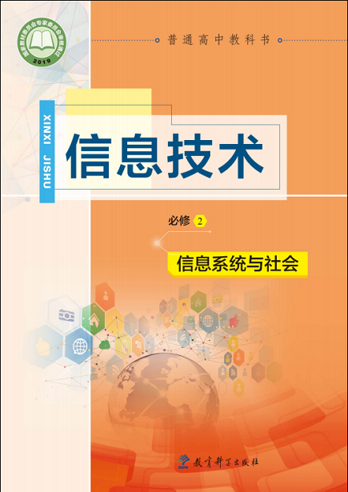

# 2020信息技术教学设计

## 第1单元 初识数据与计算
* [【第01课】感知数据](https://github.com/hongm32/2020desig/tree/master/【第01课】感知数据)
    - 了解数据与信息的特征
    - 理解数据、信息和知识的相互关系
    - 能从恰当的来源获取数据，并对数据进行简单的分析
    - 体验数字化学习过程，感受利用数字化工具和资源的优势
* [【第02课】数据计算](https://github.com/hongm32/2020desig/tree/master/【第02课】数据计算)
    - 了解计算的基本方式和计算的发展过程
    - 根据问题需求，选用恰当的计算方式
    - 感受计算机耕处理数据时的优势

## 第2单元 编程计算
* [【第03课】计算机解决问题的过程](https://github.com/hongm32/2020desig/tree/master/【第03课】计算机解决问题的过程)
    - 了解计算解决问题的过程
    - 了解流程图的规范表示方法，学会使用自然语言和流程图描述算法
    - 了解算法的三种基本结构
* [【第04课】做出判断的分支](https://github.com/hongm32/2020desig/tree/master/【第04课】做出判断的分支)
    - 掌握顺序结构、分支结构的基本结构
    - 学会赋值语句、if分支语句的使用方法
    - 运用顺序结构、分支结构的语句缩写简单的程序解决问题
* [【第05课】周而复始的循环_条件循环while](https://github.com/hongm32/2020desig/tree/master/【第05-06课】周而复始的循环)
    - 了解循环的基本结构
    - 学会条件循环的使用方法
    - 初步学会使用循环解决实际问题
* [【第06课】周而复始的循环_计数循环for](https://github.com/hongm32/2020desig/tree/master/【第05-06课】周而复始的循环)
    - 学会计数循环的使用方法
    - 熟练使用循环解决实际问题
* [【第07-08课】可以复用的代码](https://github.com/hongm32/2020design/tree/master/【第07-08课】可以复用的代码)
    - 了解函数的作用
    - 学会函数的定义和调用方法，并能熟练使用函数解决问题
    - 学会模块的载入，并熟练使用模块解决问题
    - 熟练使用函数、模块解决实际问题

## 第3单元 计算与问题解决
* [【第09课】枚举算法](https://github.com/hongm32/2020design/tree/master/【第09课】枚举算法)
    - 了解算法的基本要素和重要特征
    - 理解并熟练掌握算法的三种基本结构
    - 理解并掌握枚举算法，并利用枚举算法解决实际问题
* [【第10课】递归算法](https://github.com/hongm32/2020design/tree/master/【第10课】递归算法)
    - 理解并熟练掌握算法的三种基本结构
    - 体验递归算法，并结合具体问题开展编程实践
* [【第11课】迭代算法](https://github.com/hongm32/2020design/tree/master/【第11课】迭代算法)
    - 理解并熟练掌握算法的三种基本结构
    - 设计解析式或迭代方程，进行数值计算，解决问题
* [【第12课】二分算法](https://github.com/hongm32/2020design/tree/master/【第12课】二分算法)
    - 理解并熟练掌握算法的三种基本结构
    - 了解算法设计中的分治思想，并运用二分查找解决实际问题
    - 运用合适的算法形成解决问题的方案

## 第4单元 认识数据
* [【第13-14课】数据编码](https://github.com/hongm32/2020design/tree/master/【第13-14课】数据编码)
    - 了解各类数据采集的基本方法
    - 能够解释文本、音频等数据的编码原理
    - 理解数据编码的意义和作用
* [【第15-16课】数据与结构](https://github.com/hongm32/2020design/tree/master/【第15-16课】数据与结构)
    - 熟练队列结构的概念和特点，能够使用Python语言对队列进行操作
    - 了解树、图结构的基本概念及特点
    - 能够比较不同数据结构的特点，支选用合适的数据结构组织数据解决简单问题
* [【第17课】复习](https://github.com/hongm32/2020design/tree/master/【第17课】复习)
    - 回顾所学知识
* [【第18课】新学期开学第一课](https://github.com/hongm32/2020design/tree/master/【第18课】新学期开学第一课)
    - 巩固所学知识
    - 复习三种基本结构、循环和列表相关知识
* [【第19课】加密与解密](https://github.com/hongm32/2020design/tree/master/【第19课】加密与解密)
    - 理解数据加密和解密的概念及原理
    - 了解数据加密的历史
    - 会用Python实现简单的加密算法
    - 会分析生活中由密码引起的数据安全问题，理解对数据进行保护的意义
* [【第20课】图形界面](https://github.com/hongm32/2020design/tree/master/【第20课】图形界面)
    - 了解文件概念
    - 了解GUI的基本概念，学会设计简单的GUI

## 第5单元 数据分析与人工智能
* [【第21课】走近数据分析①](https://github.com/hongm32/2020design/tree/master/【第21课】走近数据分析①)
    - 了解数据分析的几种常用方法
    - 体验对比分析和平均分析的一般分析过程
* [【第22课】走近数据分析②](https://github.com/hongm32/2020design/tree/master/【第22课】走近数据分析②)
    - 了解大数据的含义，认识大数据分析在信息社会的重要作用
    - 深入感受数据的图形化表示
* [【第23课】走近数据分析③](https://github.com/hongm32/2020design/tree/master/【第23课】走近数据分析③)
    - 通过典型的应用实例，了解数据采集、分析和可视化表达的基本方法
    - 根据任务需求，选用恰当的软件工具或平台处理数据，完成分析报告，理解对数据进行保护的意义
* [【第24课】探秘人工智能](https://github.com/hongm32/2020design/tree/master/【第24课】探秘人工智能)
    - 了解人工智能技术的相关概念与应用领域
    - 了解人工智能技术发展的新趋势
    - 认识人工智能在信息社会中的重要作用

## 第1单元 信息系统的组成与功能

* [【第25课】信息系统的组成](https://github.com/hongm32/2020design/tree/master/【第25课】信息系统的组成与功能)
    - 能够根据需求合理地选用信息系统
    - 能够分析典型的信息系统，知道信息系统的基本组成
    - 能够根据信息系统的组成结构区分其子系统，并分析信息系统的局限
    - 初步了解信息系统对信息社会的影响

* [【第25课】信息系统的功能](https://github.com/hongm32/2020design/tree/master/【第25课】信息系统的组成与功能)
    - 通过分析实际的信息系统，知道信息系统的功能
    - 理解不同功能类型信息系统的基本工作原理
    - 体验不同功能类型信息系统的应用方法
    - 理解计算机、移动终端在信息系统中的作用
    - 树立利用信息系统进行咨询、决策的意识

## 第2单元 信息系统的集成

* [【第26课】计算机系统的组成](https://github.com/hongm32/2020design/tree/master/【第26课】计算机系统的组成)
    - 知道计算机系统的主要组成部分，能够描述其工作原理
    - 了解计算机硬件系统的基本组成，认识其主要的性能指标
    - 了解计算机软件系统的分类，区分各类软件的主要功能

* [【第27-28课】计算机系统互联](https://github.com/hongm32/2020design/tree/master/【第27-28课】计算机系统互联)
    - 认识不同类型的计算机网络系统
    - 学会评估计算机网络系统的性能指标
    - 知道网络接入方式、带宽等因素对信息系统的影响
    - 能够区分不同网络协议的功能
    - 体验利用计算机网络系统进行资源共享的优势

* [【第29课】无线局域网的组成](https://github.com/hongm32/2020design/tree/master/【第29课】无线局域网的组成)
    - 识别组建无线局域网的硬件及其功能，了解互联网的接入方式
    - 使用无线客户端连接无线网络，通过观察无线网卡状态的详细信息，理解网络配置的参数
    - 能够深刻理解传输速率、网络带宽、IP地址、子网掩码、域名解析系统和网关等概念
    - 通过组建无线局域网，体验无线跌幅器等常见设备的安装及设置方法，树立合理使用无线局域网的安全意识

* [【第30课】基于物联网的信息系统](https://github.com/hongm32/2020design/tree/master/【第30课】基于物联网的信息系统)
    - 知道信息系统与外部世界连接的方式
    - 体验带有传感器的信息系统，了解常见的传感器与控制机制
    - 体验带有射频识别功能的设备，认识射频识别对信息系统的作用
    - 了解物联网在信息社会中的应用，知道物联网的重要作用

* [【第30课】远程控制系统的组成](https://github.com/hongm32/2020design/tree/master/【第30课】远程控制系统的组成)
    - 体验远程监控系统的设计规划过程，知道常用的软硬件及其功能
    - 理解控制系统、远程监控、数字监控等相关概念，掌握远程控制机制
    - 能够利用监控软件对视频信息进行加工处理，理解对信息进行加工处理的价值和过程
    - 通过远程监控系统的组建与使用，提高利用信息系统解决问题的能力

* [【第31课】小型信息系统的组建](https://github.com/hongm32/2020design/tree/master/【第31课】小型信息系统的组建)
    - 通过动手组建红外线传感系统，体验和理解信息系统的工作过程
    - 通过组建并测试红外传感系统，理解传感器的组成和工作原理
    - 利用开源硬件组建超声波测距警报系统，体验信息的采集、判断等处理过程
    - 根据两组实验分析信息系统的工作原理，以及信息系统在社会应用中的优势和局限性

## 第4单元 信息系统的安全

* [【第32-33课】信息系统安全风险](https://github.com/hongm32/2020design/tree/master/【第32-33课】信息系统的安全)
    - 认识信息系统应用过程中存在的风险
    - 增强信息安全风险的防范意识

* [【第32-33课】信息系统安全技术](https://github.com/hongm32/2020design/tree/master/【第32-33课】信息系统的安全)
    - 探索和体验典型的信息系统安全技术
    - 掌握信息系统安全防范的常用技术方法
    - 养成规范的信息系统操作习惯

* [【第32-33课】计算机系统安全管理](https://github.com/hongm32/2020design/tree/master/【第32-33课】信息系统的安全)
    - 了解信息系统安全的范围和管理措施
    - 能够根据机构的安全策略选择适当的信息安全技术
    - 能够针对业务或机构的实际情况进行信息系统安全管理设置
    - 树立安全技术与安全管理相结合的意识

## 第5单元 信息社会的建设

* [【第34-35课】信息社会的伦理与道德](https://github.com/hongm32/2020design/tree/master/【第34-35课】信息社会的建设)
    - 了解网络礼仪的黄金规则“己所不欲，勿施于人”
    - 分析虚拟空间与现实空间的不同，了解在线发布个人信息的益处与风险
    - 知道保护自己与他人隐私信息的措施或方法

* [【第34-35课】信息社会的法律与法规](https://github.com/hongm32/2020design/tree/master/【第34-35课】信息社会的建设)
    - 了解网站收集用户个人信息的原因、方法以及需承担的责任
    - 理解个体信息与组织信息权利主体之间的利益协调原则
    - 学会分辨作品是否享有知识产权，主动保护知识产权
    - 知道信息公开的基本形式，理解信息公开对建设信息社会的意义

* [【第34-35课】信息社会的未来发展](https://github.com/hongm32/2020design/tree/master/【第34-35课】信息社会的建设)
    - 探讨信息技术对人类的影响，了解信息技术的发展趋势
    - 能够描述信息社会的基本特征，展望信息社会的未来

## 第3单元 信息系统的设计与开发

* [【第36-37课】信息系统的设计](https://github.com/hongm32/2020design/tree/master/【第36-37课】信息系统的设计)
    - 能够描述信息系统可行性分析的方法
    - 能够绘制常用信息系统的功能层次图
    - 能够对一个简单功能模块进行概要设计
    - 了解瀑布模型和快速原型模型的特点

* [【第38-40课】数据库的构建](https://github.com/hongm32/2020design/tree/master/【第38-40课】数据库的构建)
    - 体验使用不同工具管理数据的过程，简单了解数据库管理系统和数据库系统的基本概念
    - 掌握在可视化环境中创建数据表的方法
    - 能够根据信息管理需求合理设置字段属性

* [【第41-42课】信息系统的数据输入](https://github.com/hongm32/2020design/tree/master/【第41-42课】信息系统的数据输入)
    - 能够根据信息输入的要求设计HTML网页
    - 理解信息系统数据访问的基本过程
    - 能够描述将用户输入信息存储到数据库中的基本过程

* [【第43-45课】信息系统的数据处理](https://github.com/hongm32/2020design/tree/master/【第43-45课】信息系统的数据处理)
    - 能够描述信息系统中的数据处理流程
    - 理解信息系统通过程序实施自动化数据处理的方式

* [【第46-47课】信息系统的数据呈现](https://github.com/hongm32/2020design/tree/master/【第46-47课】信息系统的数据呈现)
    - 能够根据现实需求确定需要输出的数据
    - 理解数据输出样式对信息应用的影响
  